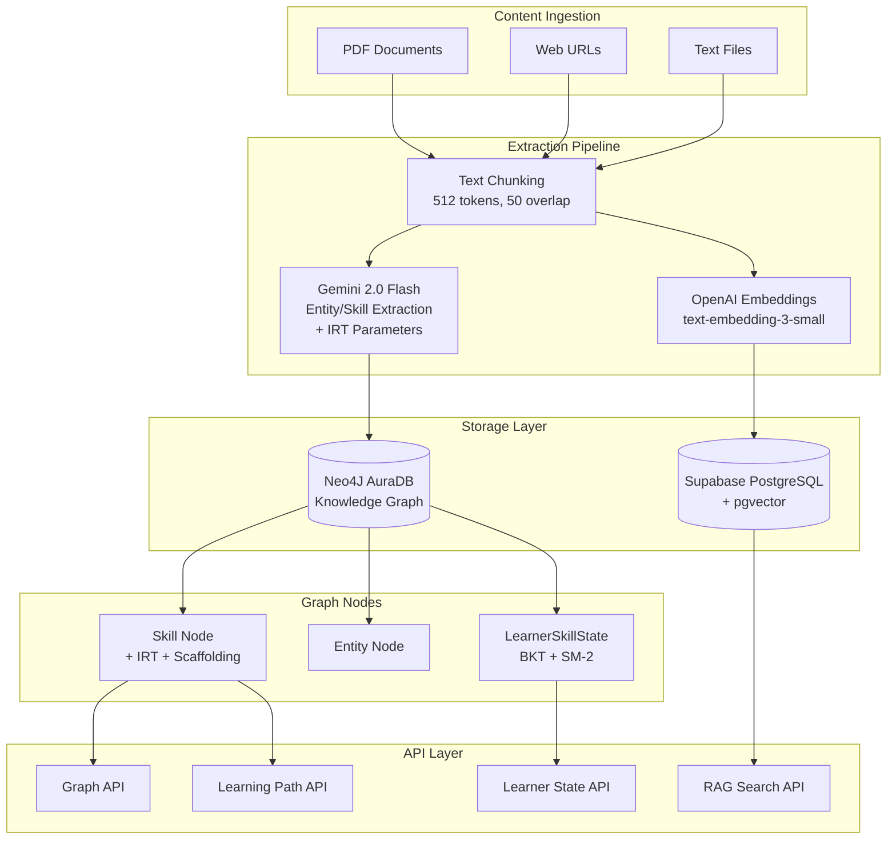
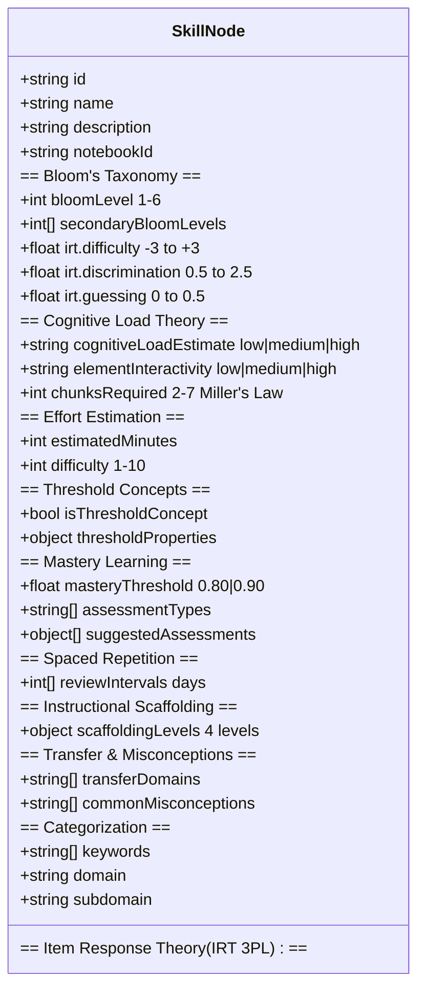
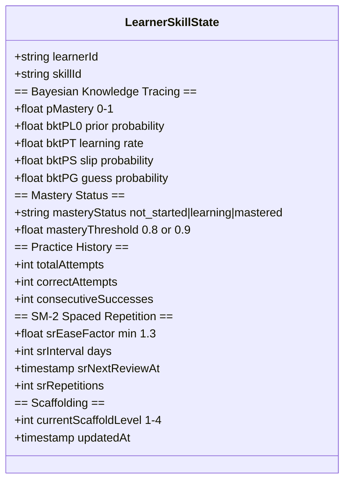
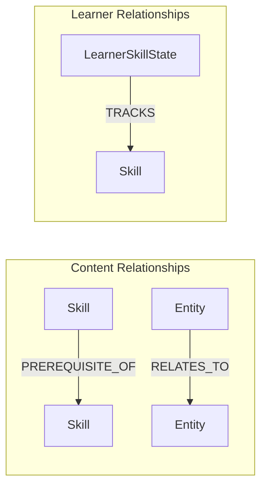
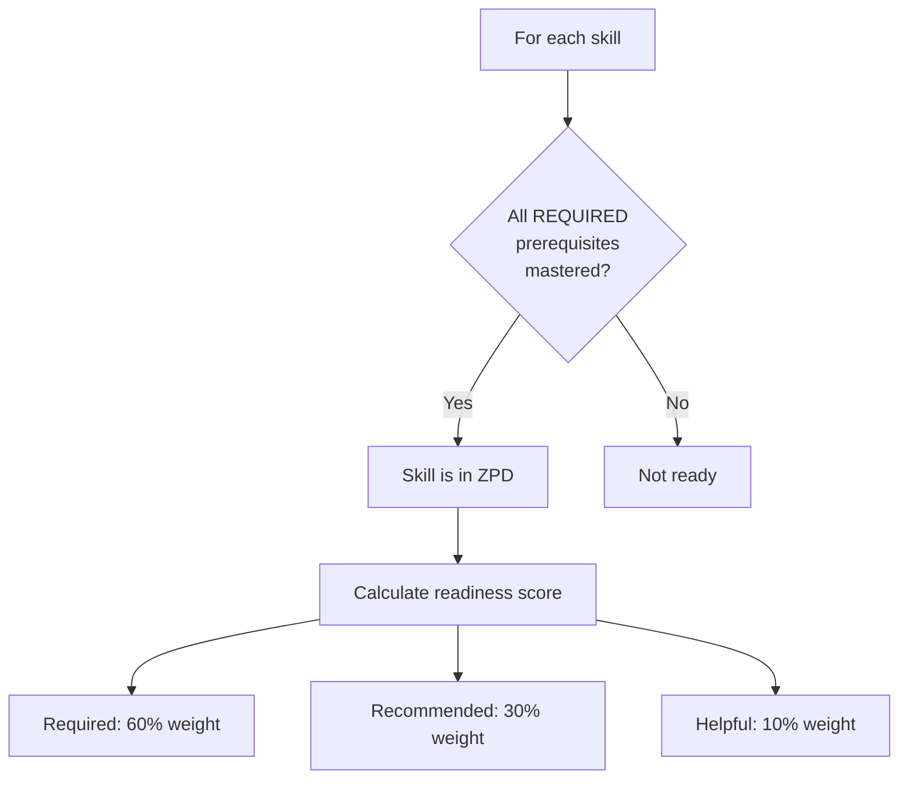
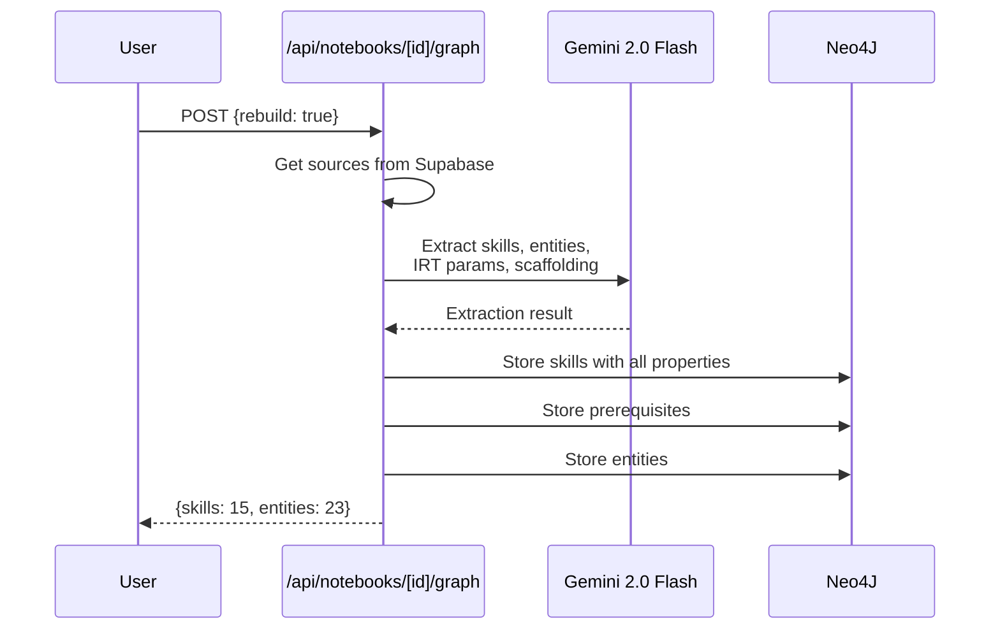
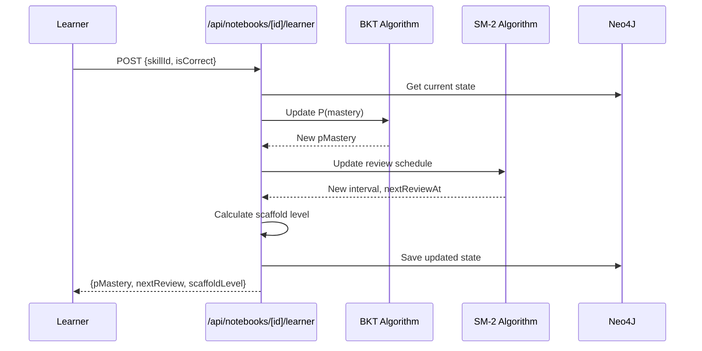

# Neo4J Educational Knowledge Graph Architecture

## Overview

LearnGraph's knowledge graph is designed around educational psychology research, incorporating theories from Bloom's Taxonomy, Cognitive Load Theory, Spaced Repetition (SM-2), Zone of Proximal Development (ZPD), Mastery Learning, Bayesian Knowledge Tracing (BKT), and Item Response Theory (IRT).

## What You Can Do With the Graph Database

### Content-Only Features (No Learner State Required)

| Feature | Description | API Endpoint |
|---------|-------------|--------------|
| **Curriculum Overview** | Skills grouped by Bloom's Taxonomy levels with time estimates | `GET /api/notebooks/[id]/graph/learning-path?action=overview` |
| **Prerequisite Visualization** | Graph of skill dependencies with required/recommended/helpful strengths | `GET /api/notebooks/[id]/graph` |
| **Learning Path Generation** | Topologically sorted path from current knowledge to goal skill | `GET /api/notebooks/[id]/graph/learning-path?action=path&goal=skillId` |
| **Threshold Concept Identification** | Highlight transformative concepts that unlock new understanding | Part of skill extraction |
| **Cognitive Load Estimation** | Identify high-load skills needing extra scaffolding | `chunksRequired`, `elementInteractivity` properties |
| **Assessment Suggestions** | Bloom-aligned assessments for each skill | `suggestedAssessments` property |
| **Scaffolding Guidance** | 4-level support descriptions (worked examples → independent) | `scaffoldingLevels` property |
| **Common Misconceptions** | Proactive teaching by knowing where students struggle | `commonMisconceptions` property |
| **Transfer Domains** | Show where skills apply in other contexts | `transferDomains` property |
| **IRT-based Difficulty** | Calibrated difficulty for adaptive question selection | `irt.difficulty`, `irt.discrimination`, `irt.guessing` |

### Learner State Features (With LearnerSkillState)

| Feature | Description | API Endpoint |
|---------|-------------|--------------|
| **Mastery Tracking (BKT)** | Probabilistic mastery estimation using Bayesian Knowledge Tracing | `POST /api/notebooks/[id]/learner` |
| **Spaced Repetition (SM-2)** | Optimized review scheduling based on forgetting curve | `GET /api/notebooks/[id]/learner?action=due` |
| **Zone of Proximal Development** | Skills ready to learn based on prerequisite mastery | `GET /api/notebooks/[id]/learner?action=zpd` |
| **Adaptive Scaffolding** | Automatically fade support as mastery increases (level 1-4) | `currentScaffoldLevel` in state |
| **Progress Dashboard** | Mastered/learning/not-started counts, average mastery | `GET /api/notebooks/[id]/learner?action=progress` |
| **Personalized Learning Paths** | Paths that skip already-mastered skills | `POST /api/notebooks/[id]/graph/learning-path` |

---

## High-Level Architecture



---

## Neo4J Node Schema

### Skill Node (Content)



### LearnerSkillState Node (Learner Progress)



### Relationships



---

## Educational Psychology Theory Implementation

### 1. Bloom's Taxonomy (Revised 2001)

| Level | Label | Description | Implementation |
|-------|-------|-------------|----------------|
| 1 | Remember | Recall facts and basic concepts | `bloomLevel: 1` |
| 2 | Understand | Explain ideas or concepts | `bloomLevel: 2` |
| 3 | Apply | Use information in new situations | `bloomLevel: 3` |
| 4 | Analyze | Draw connections among ideas | `bloomLevel: 4` |
| 5 | Evaluate | Justify a decision or course of action | `bloomLevel: 5` |
| 6 | Create | Produce new or original work | `bloomLevel: 6` |

**Used For:**
- Ordering skills in learning paths (lower levels first)
- Aligning assessments with cognitive complexity
- Inferring prerequisites (Bloom heuristic)

### 2. Cognitive Load Theory (Sweller)

| Property | Description | Values |
|----------|-------------|--------|
| `cognitiveLoadEstimate` | Overall cognitive demand | low, medium, high |
| `elementInteractivity` | Simultaneous element processing | low, medium, high |
| `chunksRequired` | Working memory slots (Miller's Law) | 2-7 |

**Used For:**
- Sequencing content to avoid overload
- Triggering additional scaffolding for high-load skills

### 3. Item Response Theory (IRT 3PL Model)

| Parameter | Symbol | Range | Description |
|-----------|--------|-------|-------------|
| `difficulty` | b | -3 to +3 | Higher = harder (0 = average) |
| `discrimination` | a | 0.5 to 2.5 | How well it differentiates ability |
| `guessing` | c | 0 to 0.5 | Probability of correct guess |

**Used For:**
- Adaptive question selection
- Accurate ability estimation
- Test calibration

### 4. Bayesian Knowledge Tracing (BKT)

```
P(mastery|correct) = P(correct|mastery) × P(mastery) / P(correct)
P(mastery_new) = P(mastery|observation) + (1 - P(mastery|observation)) × P(learn)
```

| Parameter | Default | Description |
|-----------|---------|-------------|
| `pL0` | 0.0 | Prior probability of mastery |
| `pT` | 0.1 | Probability of learning per attempt |
| `pS` | 0.1 | Probability of slip (error despite mastery) |
| `pG` | 0.2 | Probability of guess (correct despite not mastered) |

**Used For:**
- Probabilistic mastery estimation
- Determining when a skill is "mastered"

### 5. SM-2 Spaced Repetition Algorithm

```
if quality < 3:
    repetitions = 0
    interval = 1
else:
    if repetitions == 0: interval = 1
    elif repetitions == 1: interval = 6
    else: interval = interval × easeFactor
    repetitions += 1

easeFactor = easeFactor + (0.1 - (5 - quality) × (0.08 + (5 - quality) × 0.02))
easeFactor = max(1.3, easeFactor)
```

| Property | Description |
|----------|-------------|
| `easeFactor` | Multiplier for interval (min 1.3) |
| `interval` | Days until next review |
| `repetitions` | Consecutive successful reviews |
| `nextReviewAt` | Timestamp for next review |

**Used For:**
- Optimizing review timing
- Preventing forgetting

### 6. Zone of Proximal Development (Vygotsky)



**Used For:**
- Recommending what to learn next
- Avoiding frustration (too hard) or boredom (too easy)

### 7. Mastery Learning (Bloom's Mastery)

| Property | Regular Skills | Threshold Concepts |
|----------|---------------|-------------------|
| `masteryThreshold` | 0.80 | 0.90 |
| Required consecutive successes | 3 | 3 |

**Used For:**
- Ensuring solid foundation before advancing
- Higher bar for critical gateway concepts

### 8. Instructional Scaffolding (Bruner/Wood)

| Level | Description | When Used |
|-------|-------------|-----------|
| 1 | Full worked examples | P(mastery) < 0.3 |
| 2 | Partial solutions | P(mastery) 0.3-0.5 |
| 3 | Hints on request | P(mastery) 0.5-0.7 |
| 4 | Independent practice | P(mastery) > 0.7 |

**Used For:**
- Gradual release of responsibility
- Preventing learned helplessness

---

## API Endpoints Reference

### Graph API

| Endpoint | Method | Description |
|----------|--------|-------------|
| `/api/notebooks/[id]/graph` | GET | Get full knowledge graph |
| `/api/notebooks/[id]/graph` | POST | Extract graph from sources |
| `/api/notebooks/[id]/graph` | DELETE | Delete graph data |

### Learning Path API

| Endpoint | Method | Description |
|----------|--------|-------------|
| `/api/notebooks/[id]/graph/learning-path?action=overview` | GET | Curriculum by Bloom levels |
| `/api/notebooks/[id]/graph/learning-path?action=zpd&mastered=...` | GET | ZPD skills (client-provided mastery) |
| `/api/notebooks/[id]/graph/learning-path?action=path&goal=...` | GET | Path to goal skill |
| `/api/notebooks/[id]/graph/learning-path?action=all-skills` | GET | All skills with details |
| `/api/notebooks/[id]/graph/learning-path` | POST | Generate personalized path |

### Learner State API

| Endpoint | Method | Description |
|----------|--------|-------------|
| `/api/notebooks/[id]/learner?action=progress` | GET | Progress summary |
| `/api/notebooks/[id]/learner?action=states` | GET | All learner states |
| `/api/notebooks/[id]/learner?action=due` | GET | Skills due for review |
| `/api/notebooks/[id]/learner?action=zpd` | GET | ZPD skills (using actual mastery) |
| `/api/notebooks/[id]/learner?action=mastered` | GET | Mastered skill IDs |
| `/api/notebooks/[id]/learner` | POST | Record practice attempt |
| `/api/notebooks/[id]/learner` | DELETE | Reset progress |

### Practice Attempt Request

```json
POST /api/notebooks/[id]/learner
{
  "skillId": "skill_xxx",
  "isCorrect": true,
  "responseTimeMs": 5000,      // optional
  "expectedTimeMs": 10000,     // optional
  "masteryThreshold": 0.8      // optional, default 0.8
}
```

### Practice Attempt Response

```json
{
  "available": true,
  "updatedState": {
    "pMastery": 0.65,
    "masteryStatus": "learning",
    "currentScaffoldLevel": 2,
    "spacedRepetition": {
      "interval": 6,
      "nextReviewAt": 1737590400000
    }
  },
  "progress": {
    "totalSkills": 25,
    "masteredSkills": 8,
    "learningSkills": 5,
    "notStartedSkills": 12,
    "averageMastery": 0.42,
    "skillsDueForReview": 3
  },
  "message": "Mastery: 65.0%"
}
```

---

## Data Flow Diagrams

### Content Extraction Flow



### Practice Attempt Flow



---

## Complete Property Reference

### SkillNode Properties

| Category | Property | Type | Description |
|----------|----------|------|-------------|
| **Identity** | `id` | string | Unique identifier |
| | `name` | string | Skill name |
| | `description` | string | Skill description |
| | `notebookId` | string | Parent notebook |
| **Bloom's** | `bloomLevel` | 1-6 | Primary taxonomy level |
| | `secondaryBloomLevels` | int[] | Additional levels |
| **IRT** | `irt.difficulty` | -3 to +3 | Item difficulty (b) |
| | `irt.discrimination` | 0.5-2.5 | Discrimination (a) |
| | `irt.guessing` | 0-0.5 | Guessing prob (c) |
| **Cognitive Load** | `cognitiveLoadEstimate` | string | low/medium/high |
| | `elementInteractivity` | string | low/medium/high |
| | `chunksRequired` | 2-7 | Working memory slots |
| **Effort** | `estimatedMinutes` | int | Time to learn |
| | `difficulty` | 1-10 | Simple difficulty scale |
| **Threshold** | `isThresholdConcept` | bool | Gateway concept |
| | `thresholdProperties` | object | Unlocks, troublesome |
| **Mastery** | `masteryThreshold` | 0.8/0.9 | Required mastery |
| | `assessmentTypes` | string[] | Assessment categories |
| | `suggestedAssessments` | object[] | Specific assessments |
| **Spaced Rep** | `reviewIntervals` | int[] | Days between reviews |
| **Scaffolding** | `scaffoldingLevels` | object | 4-level descriptions |
| **Transfer** | `transferDomains` | string[] | Application domains |
| | `commonMisconceptions` | string[] | Student errors |
| **Categorization** | `keywords` | string[] | Search terms |
| | `domain` | string | Subject area |
| | `subdomain` | string | Sub-topic |

### LearnerSkillState Properties

| Category | Property | Type | Description |
|----------|----------|------|-------------|
| **Identity** | `learnerId` | string | User ID |
| | `skillId` | string | Skill ID |
| **BKT** | `pMastery` | 0-1 | Current P(mastery) |
| | `bktParams.pL0` | float | Prior probability |
| | `bktParams.pT` | float | Learning rate |
| | `bktParams.pS` | float | Slip probability |
| | `bktParams.pG` | float | Guess probability |
| **Mastery** | `masteryStatus` | string | not_started/learning/mastered |
| | `masteryThreshold` | float | Required for mastery |
| **History** | `totalAttempts` | int | Total practice count |
| | `correctAttempts` | int | Correct count |
| | `consecutiveSuccesses` | int | Streak count |
| **SM-2** | `spacedRepetition.easeFactor` | float | EF (min 1.3) |
| | `spacedRepetition.interval` | int | Days to next review |
| | `spacedRepetition.nextReviewAt` | timestamp | Review due date |
| | `spacedRepetition.repetitions` | int | Review count |
| **Scaffolding** | `currentScaffoldLevel` | 1-4 | Support level |

---

## Summary: What the Graph Enables

### Without Learner Tracking
1. ✅ Visualize skill prerequisites
2. ✅ Generate learning paths to any goal
3. ✅ Identify threshold concepts
4. ✅ Estimate cognitive load
5. ✅ Suggest Bloom-aligned assessments
6. ✅ Show scaffolding guidance
7. ✅ Warn about common misconceptions
8. ✅ Highlight transfer opportunities
9. ✅ IRT-calibrated difficulty for question banks

### With Learner Tracking
10. ✅ Track individual mastery (BKT)
11. ✅ Schedule spaced repetition reviews (SM-2)
12. ✅ Calculate true ZPD based on mastery
13. ✅ Adapt scaffolding automatically
14. ✅ Personalize learning paths (skip mastered)
15. ✅ Dashboard with progress metrics
16. ✅ Predict performance on new skills
