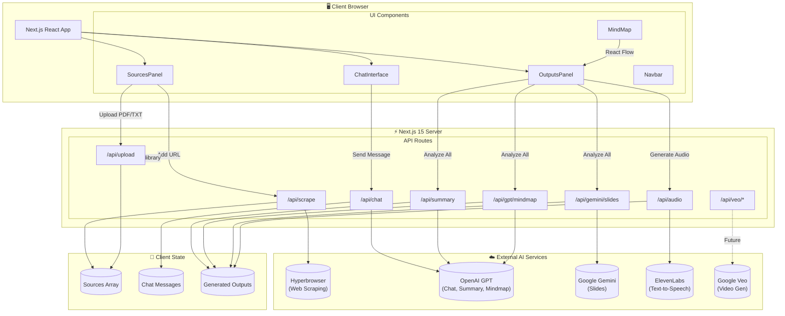
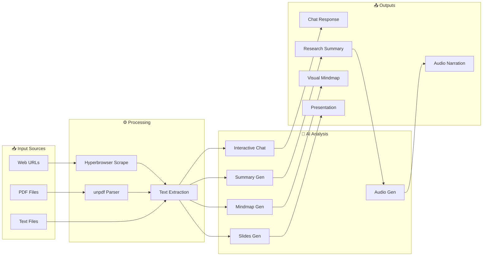
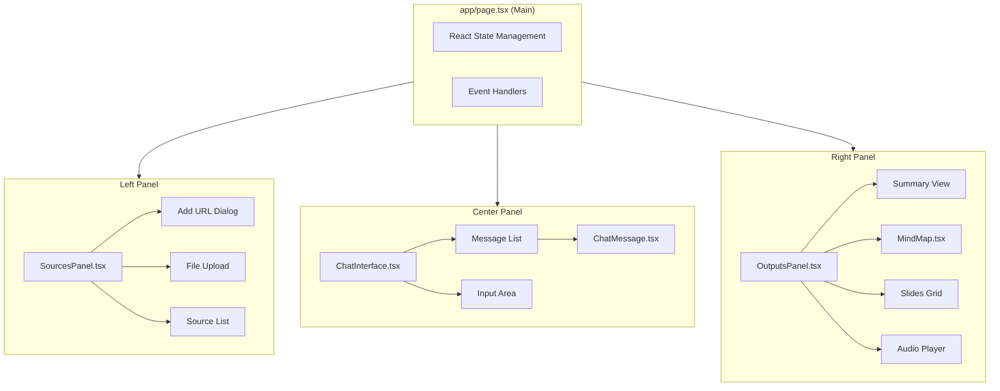
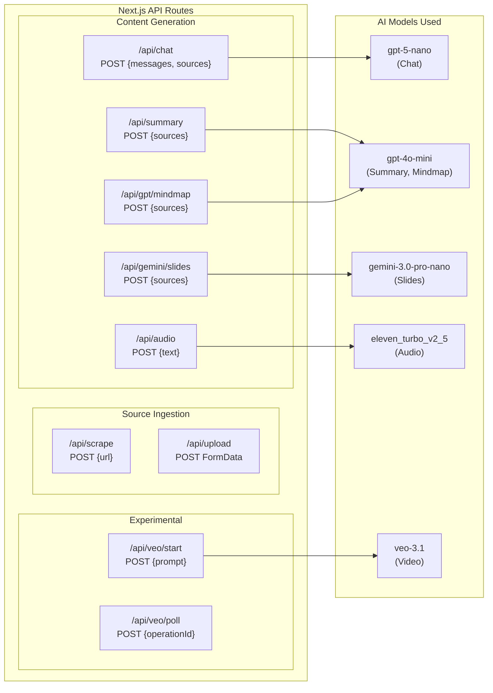
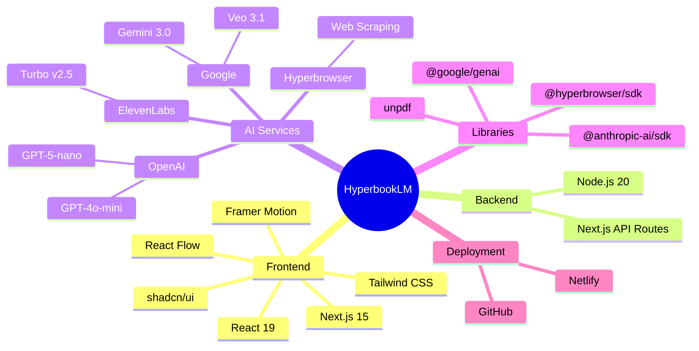

# HyperbookLM Architecture

## High-Level System Architecture

```mermaid
flowchart TB
    subgraph Client["🖥️ Client Browser"]
        UI[Next.js React App]
        subgraph Components["UI Components"]
            SP[SourcesPanel]
            CI[ChatInterface]
            OP[OutputsPanel]
            MM[MindMap]
            NB[Navbar]
        end
    end

    subgraph NextJS["⚡ Next.js 15 Server"]
        subgraph APIRoutes["API Routes"]
            scrape["/api/scrape"]
            upload["/api/upload"]
            chat["/api/chat"]
            summary["/api/summary"]
            mindmap["/api/gpt/mindmap"]
            slides["/api/gemini/slides"]
            audio["/api/audio"]
            veo["/api/veo/*"]
        end
    end

    subgraph External["☁️ External AI Services"]
        HB[("Hyperbrowser\n(Web Scraping)")]
        OAI[("OpenAI GPT\n(Chat, Summary, Mindmap)")]
        GEM[("Google Gemini\n(Slides)")]
        EL[("ElevenLabs\n(Text-to-Speech)")]
        VEO[("Google Veo\n(Video Gen)")]
    end

    subgraph Storage["📁 Client State"]
        Sources[(Sources Array)]
        Messages[(Chat Messages)]
        Outputs[(Generated Outputs)]
    end

    %% User Interactions
    UI --> SP & CI & OP

    %% Source Ingestion
    SP -->|"Add URL"| scrape
    SP -->|"Upload PDF/TXT"| upload
    scrape --> HB
    upload -->|"unpdf library"| NextJS

    %% Chat Flow
    CI -->|"Send Message"| chat
    chat --> OAI

    %% Analysis Flow
    OP -->|"Analyze All"| summary & mindmap & slides
    summary --> OAI
    mindmap --> OAI
    slides --> GEM

    %% Audio Generation
    OP -->|"Generate Audio"| audio
    audio --> EL

    %% Video Generation (Partial)
    veo -.->|"Future"| VEO

    %% State Management
    scrape & upload --> Sources
    chat --> Messages
    summary & mindmap & slides & audio --> Outputs

    MM -->|"React Flow"| OP
```

## Data Flow Architecture

```mermaid
flowchart LR
    subgraph Input["📥 Input Sources"]
        URL[Web URLs]
        PDF[PDF Files]
        TXT[Text Files]
    end

    subgraph Processing["⚙️ Processing"]
        Scrape[Hyperbrowser Scrape]
        Parse[unpdf Parser]
        Extract[Text Extraction]
    end

    subgraph Analysis["🧠 AI Analysis"]
        Chat[Interactive Chat]
        Sum[Summary Gen]
        Mind[Mindmap Gen]
        Slide[Slides Gen]
        Audio[Audio Gen]
    end

    subgraph Output["📤 Outputs"]
        ChatOut[Chat Response]
        SumOut[Research Summary]
        MindOut[Visual Mindmap]
        SlideOut[Presentation]
        AudioOut[Audio Narration]
    end

    URL --> Scrape --> Extract
    PDF --> Parse --> Extract
    TXT --> Extract

    Extract --> Chat --> ChatOut
    Extract --> Sum --> SumOut
    Extract --> Mind --> MindOut
    Extract --> Slide --> SlideOut
    SumOut --> Audio --> AudioOut
```

## Component Architecture

```mermaid
flowchart TB
    subgraph App["app/page.tsx (Main)"]
        State[React State Management]
        Handlers[Event Handlers]
    end

    subgraph LeftPanel["Left Panel"]
        SourcesPanel[SourcesPanel.tsx]
        AddSource[Add URL Dialog]
        FileUpload[File Upload]
        SourceList[Source List]
    end

    subgraph CenterPanel["Center Panel"]
        ChatInterface[ChatInterface.tsx]
        MessageList[Message List]
        InputArea[Input Area]
        ChatMessage[ChatMessage.tsx]
    end

    subgraph RightPanel["Right Panel"]
        OutputsPanel[OutputsPanel.tsx]
        SummaryTab[Summary View]
        MindmapTab[MindMap.tsx]
        SlidesTab[Slides Grid]
        AudioTab[Audio Player]
    end

    App --> LeftPanel & CenterPanel & RightPanel

    SourcesPanel --> AddSource & FileUpload & SourceList
    ChatInterface --> MessageList & InputArea
    MessageList --> ChatMessage
    OutputsPanel --> SummaryTab & MindmapTab & SlidesTab & AudioTab
```

## API Route Details

```mermaid
flowchart LR
    subgraph Routes["Next.js API Routes"]
        direction TB

        subgraph Ingestion["Source Ingestion"]
            R1["/api/scrape\nPOST {url}"]
            R2["/api/upload\nPOST FormData"]
        end

        subgraph Generation["Content Generation"]
            R3["/api/chat\nPOST {messages, sources}"]
            R4["/api/summary\nPOST {sources}"]
            R5["/api/gpt/mindmap\nPOST {sources}"]
            R6["/api/gemini/slides\nPOST {sources}"]
            R7["/api/audio\nPOST {text}"]
        end

        subgraph Experimental["Experimental"]
            R8["/api/veo/start\nPOST {prompt}"]
            R9["/api/veo/poll\nPOST {operationId}"]
        end
    end

    subgraph Models["AI Models Used"]
        M1["gpt-5-nano\n(Chat)"]
        M2["gpt-4o-mini\n(Summary, Mindmap)"]
        M3["gemini-3.0-pro-nano\n(Slides)"]
        M4["eleven_turbo_v2_5\n(Audio)"]
        M5["veo-3.1\n(Video)"]
    end

    R3 --> M1
    R4 & R5 --> M2
    R6 --> M3
    R7 --> M4
    R8 --> M5
```

## Tech Stack

```mermaid
mindmap
  root((HyperbookLM))
    Frontend
      Next.js 15
      React 19
      Tailwind CSS
      Framer Motion
      React Flow
      shadcn/ui
    Backend
      Next.js API Routes
      Node.js 20
    AI Services
      OpenAI
        GPT-5-nano
        GPT-4o-mini
      Google
        Gemini 3.0
        Veo 3.1
      ElevenLabs
        Turbo v2.5
      Hyperbrowser
        Web Scraping
    Libraries
      unpdf
      @anthropic-ai/sdk
      @google/genai
      @hyperbrowser/sdk
    Deployment
      Netlify
      GitHub
```
